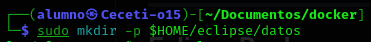
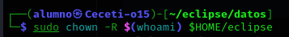
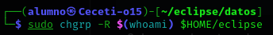
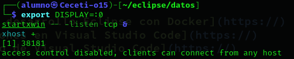
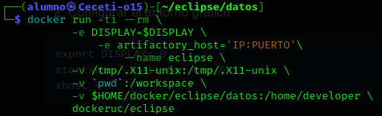
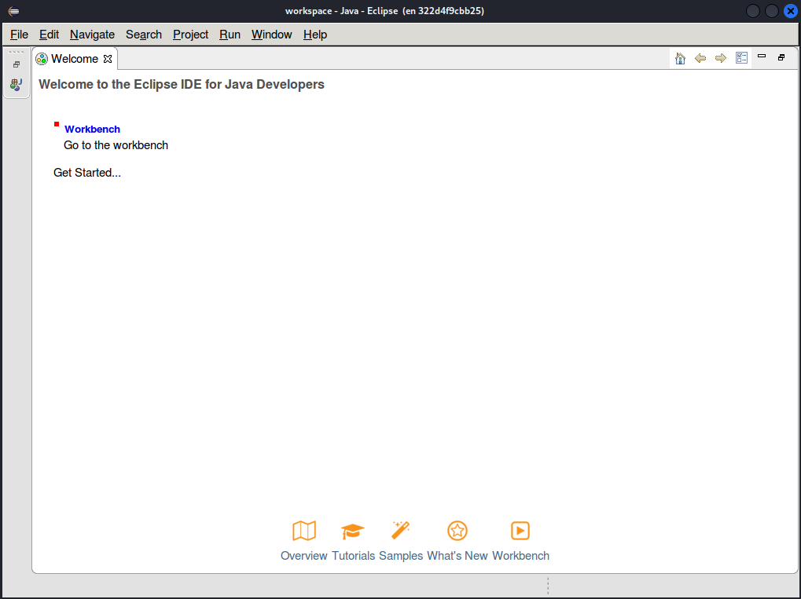
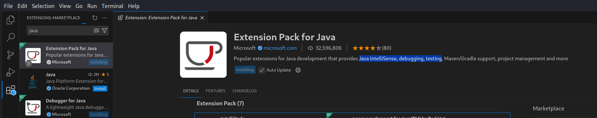

# PPS-Unidad1Actividad1-Álvaro

En esta actividad trabajaremos con entornos de desarrollo:

----

## Indice:
### [Creando entorno de desarrollo Eclipse con Docker](#creando-entorno-de-desarrollo-eclipse-con-docker)
### [Instalando extensiones en Visual Studio Code](#instalando-extensiones-en-visual-studio-code)
### [Probando el entorno de Visual Studio Code](#probando-el-entorno-de-visual-studio-code)

----
## Creando entorno de desarrollo Eclipse con Docker

Lo primero es crear la carpeta necesaria para el IDE:



Cambiamos el propietario de la carpeta y sus subcarpetas a mi usuario:



Asociamos el grupo propietario de la carpeta a mi usuario:



Definimos la pantalla gráfica y el servidor X:



Ahora lanzamos el contenedor:



Lanza un contenedor interactivo a partir de la imagen ```dockeruc/eclipse``` que se elimina al salir de el, tiene dos variables de entorno, tanto ```DISPLAY``` como ```artifactory_host```, le da el nombre ```eclipse``` al contenedor, le otorga 3 volumenes para persistir los datos.

Una vez echo esto ya se ejecuta el contenedor:



----
## Instalando extensiones en Visual Studio Code
En este ejercicio vamos a instalar varias extensiones para Visual Studio Code que nos facilitarán el desarrollo de código:

Para ello nos vamos a la opción que aparecen cuatro cuadrados de las opciones de la izquierda, se nos abre un buscador y podremos indicar el nombre de la extensión a instalar, la primera va a ser "Extension Pack for Java" que ofrece herramientas para facilitar el desarrollo con Java como "Java IntelliSense", "debugging", "testing", etc...




