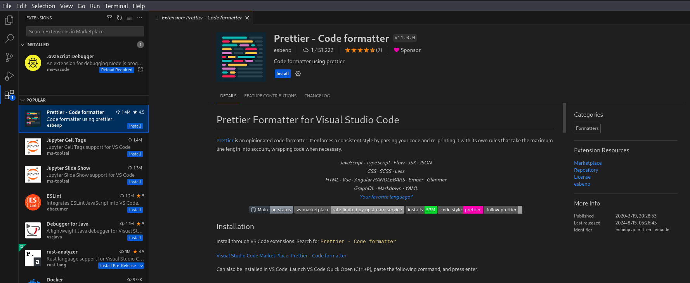
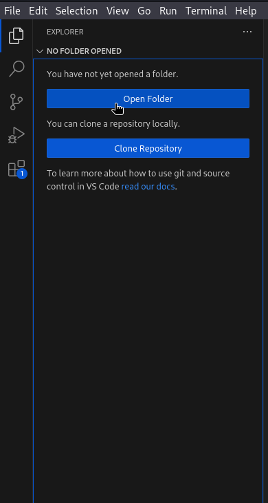
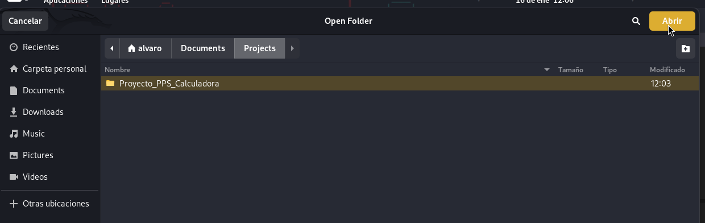
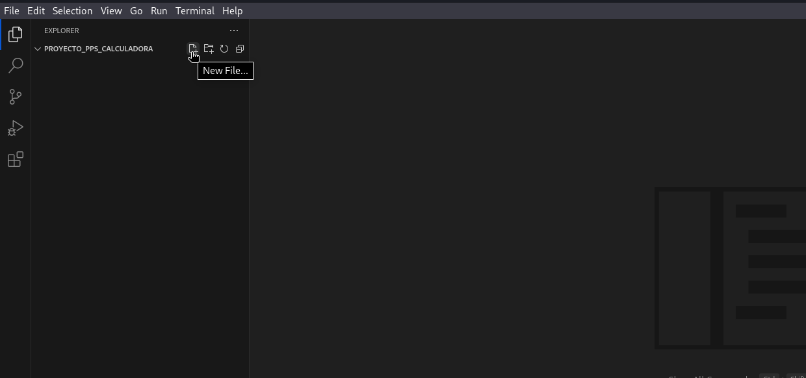
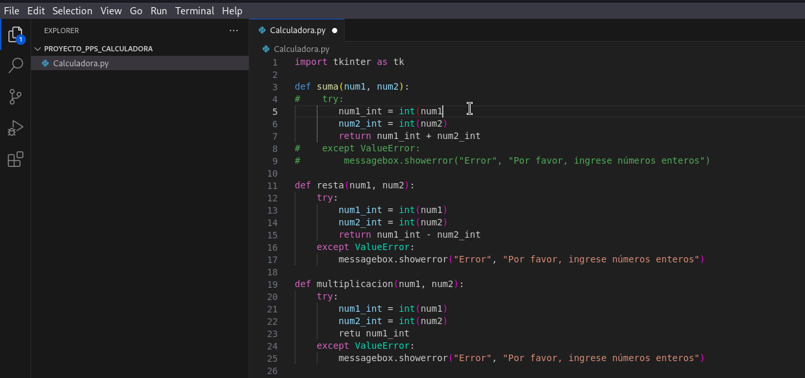
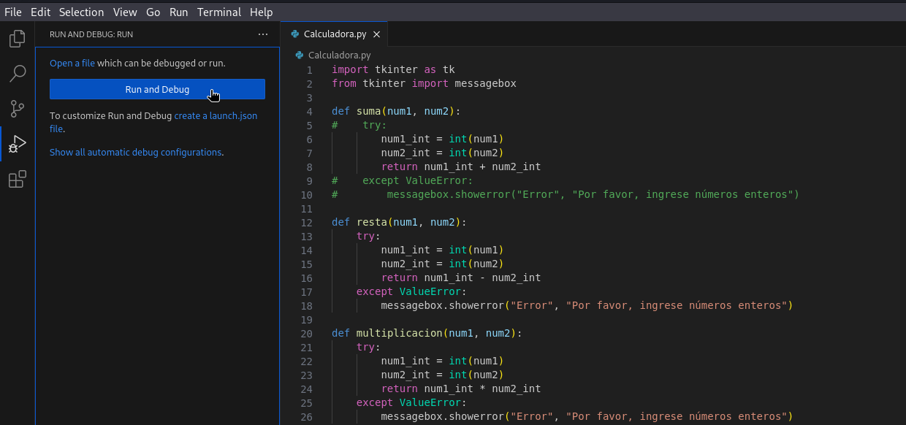
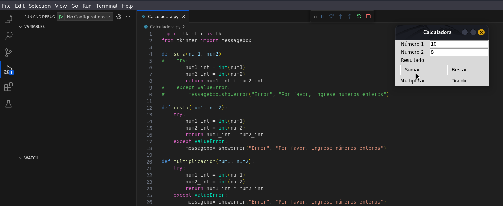
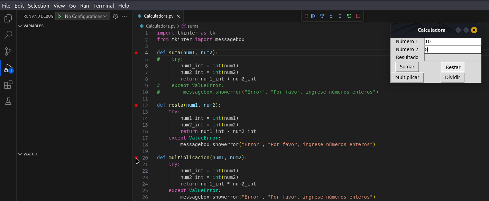

# PPS-Unidad1Actividad1-Álvaro

En esta actividad trabajaremos con entornos de desarrollo:

----

## Indice:
### [Creando entorno de desarrollo Eclipse con Docker](#creando-entorno-de-desarrollo-eclipse-con-docker-1)
### [Instalando extensiones en Visual Studio Code](#instalando-extensiones-en-visual-studio-code-1)
### [Probando el entorno de Visual Studio Code](#probando-el-entorno-de-visual-studio-code-1)

----
## Creando entorno de desarrollo Eclipse con Docker

Lo primero es crear la carpeta necesaria para el IDE:


Cambiamos el propietario de la carpeta y sus subcarpetas a mi usuario:


Asociamos el grupo propietario de la carpeta a mi usuario:


Definimos la pantalla gráfica y el servidor X:


Ahora lanzamos el contenedor:


Lanza un contenedor interactivo a partir de la imagen ```dockeruc/eclipse``` que se elimina al salir de el, tiene dos variables de entorno, tanto ```DISPLAY``` como ```artifactory_host```, le da el nombre ```eclipse``` al contenedor, le otorga 3 volumenes para persistir los datos.

Una vez echo esto ya se ejecuta el contenedor:


----
## Instalando extensiones en Visual Studio Code
En este ejercicio vamos a instalar varias extensiones para Visual Studio Code que nos facilitarán el desarrollo de código:

Para ello nos vamos a la opción que aparecen cuatro cuadrados de las opciones de la izquierda, se nos abre un buscador y podremos indicar el nombre de la extensión a instalar:


Ahora vamos a instalar la extensión de **Error Lens** que nos ayuda a visualizar errores de código:


Y ahora vamos a instalar la estensión de **Prettier - Code formatter** que nos ayuda a ordenar nuestro código para que sea más fácil de leer y seguir un único estilo para que sea mas fácil la colaboración:



---
## Probando el entorno de Visual Studio Code

Para este ejercicio vamos a abrir un paqueño proyecto para ver la utilidad de las extensiones y de las herramientas de depuración:

Lo primero es crear una carpeta (que va a ser la que contenga nuestro proyecto) y desde **VSCode** la abrimos:





Una vez abierta si le damos a la hoja de papel podremos crear un fichero con la extensión deseada:



En mi caso voy a crear un fichero llamado **_calculadora.py_** y voy a poner un código para pobar la herramientas de depuración y las extensiones:



Al poner un código vemos que sale correctamente indentado y con diferentes colores para facilitar su lectura, gracias a la extensión de **"Prettier"**, además al quitar un paréntesis de cierre, el otro parentesis de apertura se vuelve de color rojo para indicarnos que no se esta cerrando, gracias a la extensión de **"Error Lens"**.

Para comenzar a debuggear nuestro código debemos darle a la opción de la izquiera de un triangulo con un bicho, y dentro a `Run and Debug`:





Cuando le damos a **Run and Debug** se ejecuta el programa, pero el flujo de ejecución se va deteniendo para que podamos ver el valor de la diferentes variables a lo largo de la ejecución, las opciones que han aparecido en la parte superior sirven para pausar la ejecución del programa, reiniciar la ejecución del programa y parar la ejecución del programa.

Tambien podemos poner puntos de interrupción en algun lugar del código para que cuando la ejecución llegue a ese punto se detenga, y ahora se habilitan tres opciones mas de la parte superior que nos permiten ir cambiando la ejecución de un punto de interrupción a otro, asi como avanzar la ejecución hasta el siguiente punto de interrupción:



