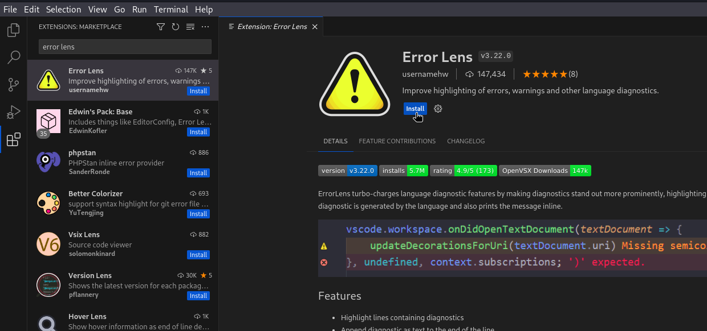
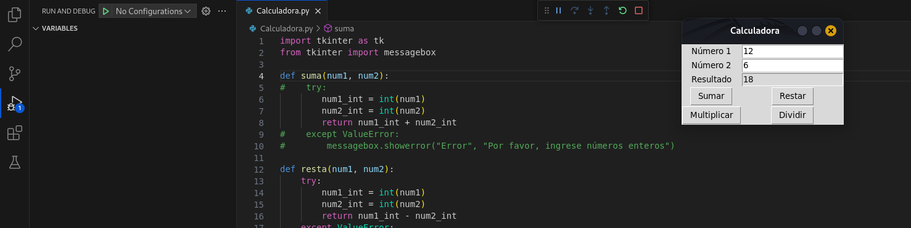
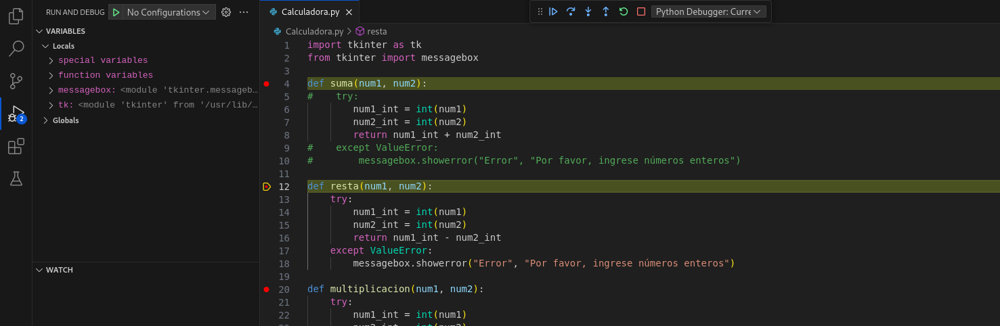

Ahora vamos a instalar la extensión de **Error Lens** que nos ayuda a visualizar errores de código:

Y por último vamos a instalar la estensión de **Prettier - Code formatter** que nos ayuda a ordenar nuestro código para que sea más fácil de leer y seguir un único estilo para que sea mas fácil la colaboración:

---

Para este ejercicio vamos a abrir un paqueño proyecto para ver la utilidad de las extensiones y de las herramientas de depuración:

Lo primero es crear una carpeta (que va a ser la que contenga nuestro proyecto) y desde **VSCode** la abrimos:

Una vez abierta si le damos a la hoja de papel podremos crear un fichero con la extensión deseada:

En mi caso voy a crear un fichero llamado **_calculadora.py_** y voy a poner un código para pobar la herramientas de depuración y las extensiones:

Al poner un código vemos que sale correctamente indentado y con diferentes colores para facilitar su lectura, gracias a la extensión de **"Prettier"**, además al quitar un paréntesis de cierre, el otro parentesis de apertura se vuelve de color rojo para indicarnos que no se esta cerrando, gracias a la extensión de **"Error Lens"**.

Para comenzar a debuggear nuestro código debemos darle a la opción de la izquiera de un triangulo con un bicho, y dentro a `Run and Debug`:

Cuando le damos a **Run and Debug** se ejecuta el programa, pero el flujo de ejecución se va deteniendo para que podamos ver el valor de la diferentes variables a lo largo de la ejecución, las opciones que han aparecido en la parte superior sirven para pausar la ejecución del programa, reiniciar la ejecución del programa y parar la ejecución del programa.

Tambien podemos poner puntos de interrupción en algun lugar del código para que cuando la ejecución llegue a ese punto se detenga, y ahora se habilitan tres opciones mas de la parte superior que nos permiten ir cambiando la ejecución de un punto de interrupción a otro, asi como avanzar la ejecución hasta el siguiente punto de interrupción:

